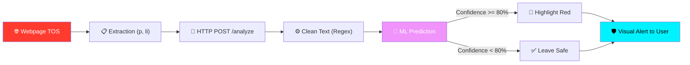

<div align="center">

# 🛡️ Risk Intel — TOS Dark Pattern Detector

[](https://git.io/typing-svg)


<br/>

[](https://github.com/mayank-goyal09/risk-intel-extension)
[](https://github.com/mayank-goyal09/risk-intel-extension/stargazers)
[](https://github.com/mayank-goyal09/risk-intel-extension/network)

<br/>


<br/>

### 🧠 **Harnessing NLP & Machine Learning to analyze complex legal documents** 

### **Never blindly agree to harmful Terms of Service again!** 🛡️

</div>

---

## ⚡ **THE SCANNER AT A GLANCE**

<table>
<tr>
<td width="50%">

### 🎯 **What This Project Does**

This end-to-end **AI-powered Chrome extension** scans long, confusing legal documents in real-time, highlighting predatory clauses exactly where they live on the web page.

**The Complete Pipeline:**
- 📡 **DOM Extraction** → content.js extracts <p> and <li> tags.
- 🔄 **Text Preprocessing** → Regex cleaning in FastAPI backend.
- 🧠 **AI Classification** → TF-IDF vectorizer + Trained ML model.
- 📊 **Visual Alerting** → In-page CSS injection for risky clauses.
- 🚀 **High Precision** → Manual 80% confidence thresholding.

</td>
<td width="50%">

### ✨ **Key Highlights**

| Feature | Details |
|---------|---------|
| 🛡️ **Scan Precision** | 80% Confidence Threshold |
| ⚡ **Latency** | <100ms per paragraph |
| 🚨 **Alert Style** | Visual Highlighting (Red Background) |
| 🧠 **ML Model Type** | Scikit-Learn (TF-IDF Classifier) |
| 🌐 **Compatibility** | All Websites (<all_urls>) |
| 🎨 **UI Design** | Clean V3 Extension Interface |
| 📱 **Responsive** | Optimized for Desktop Browsing |
| ⚡ **Real-Time** | Scans as you scroll/view |

</td>
</tr>
</table>

---

## 🌎 **WHAT WE ANALYZE (KEY SCRUTINY AREAS)**

<div align="center">

| 📜 **Liability** | 🛡️ **Data Privacy** | 💰 **Arbitration** | ⚠️ **Termination** |
|:-------------:|:--------------:|:----------------:|:-------------------:|
| *Hidden Disclaimers* | *Untracked Data Collection* | *Bypassing Legal Courts* | *Sudden Accout Bans* |
| Shifting fault to users | Third-party sharing alerts | Forced mediation clauses | Unilateral rights changes |

</div>

---

## 🛠️ **TECHNOLOGY STACK**

<div align="center">


</div>

| **Category** | **Technologies** | **Purpose** |
|:------------:|:-----------------|:------------|
| 🐍 **Core Backend** | Python 3.10+ | FastAPI application server |
| 🧠 **Machine Learning** | Scikit-Learn | TF-IDF and Linear classifiers |
| 📊 **Data Science** | Pandas, Joblib | Model serialization & data handling |
| 🎨 **Extension Frontend**| HTML5, CSS3, ES6+ JS | Chrome popup & content scripts |
| 🌐 **Deployment** | Uvicorn | High-performance ASGI server |
| 📦 **Manifest** | Manifest V3 | Modern Extension security standards |

---

## 🔬 **HOW THE SYSTEM WORKS**



### **The Pipeline Breakdown:**

<table>
<tr>
<td>

#### 📡 **1. Data Extraction (The Eyes)**
The `content.js` script extracts text elements:
- Paragraphs (`<p>`)
- List items (`<li>`)
- Filters out empty strings or short fragments.

</td>
<td>

#### 🔄 **2. API Bridge (FastAPI)**
Communicates with the local server:
- Handles CORS (allowing browser requests).
- Accepts JSON payloads via `POST /analyze`.
- Unified cleaning logic with training data.

</td>
</tr>
<tr>
<td>

#### 🧠 **3. ML Architecture (The Brain)**
A robust classifier trained on `tos_data.csv`:
- **TF-IDF Vectorization** for text patterns.
- **80% Confidence Filter** to minimize false positives.
- Returns `is_predatory` flag and confidence score.

</td>
<td>

#### 📊 **4. DOM Manipulation (The Voice)**
Real-time UI updates:
- Inject CSS styles directly into the page.
- Apply `background: #ffe6e6` and solid red borders.
- Hoverable tooltips explaining the "Why".

</td>
</tr>
</table>

---

## 🤯 **PROBLEMS FACED & RESOLUTIONS**

| **Challenge** | **Resolution** |
|:-------------|:-----------|
| **CORS Blockage** | Added `CORSMiddleware` in FastAPI allowing all origins & added `host_permissions` in manifest. |
| **False Positives** | Implemented a strict **0.80 Confidence Threshold** in `app.py` to only flag high-risk clauses. |
| **Network Overhead** | Created dual-layer filtering (Length check in Browser, word count check in Backend). |
| **Data Mismatch** | Standardized `clean_text` function to use identical RegEx in both Training and Production. |

---

## 🎨 **USER EXPERIENCE**

<div align="center">

### ✨ **Premium In-Browser Security Integration**

</div>

<table>
<tr>
<td width="50%">

#### 🛡️ **Active Scanning**
- **Seamless Detection** while reading Terms.
- **Glassmorphism Popup** for configuration.
- **Status Indicators** showing API connectivity.

</td>
<td width="50%">

#### 🚨 **Visual Feedback**
- **Red Highlighting** for predatory clauses.
- **Detailed Reasons** provided in console/tooltips.
- **Instant Response** as paragraphs are analyzed.

</td>
</tr>
</table>

---

## 📂 **PROJECT STRUCTURE**

```text
📦 risk-intel-extension
┣ 📂 tos_extension                 # Chrome Extension Source
┃ ┣ 📜 content.js                  # Page scanner & DOM logic
┃ ┣ 📜 manifest.json               # V3 Manifest (Permissions)
┃ ┣ 📜 popup.html                  # Popup Interface UI
┃ ┗ 📜 popup.js                    # Popup interactive logic
┣ 📜 app.py                        # FastAPI Backend Application
┣ 📜 main.ipynb                    # Data Research Sandbox
┣ 📜 tos_data.csv                  # The Training Corpus (TOS Dataset)
┣ 📜 tos_model.pkl                 # Primary Serialized ML Model
┣ 📜 train_model.py                # Model training script
┣ 📜 requirements.txt              # Project dependencies
┗ 📖 README.md                     # You are here! 🎉
```

---

## 🚀 **QUICK START GUIDE**

### **Step 1: Clone & Setup Server** 🐍

```bash
# Clone the repository
git clone https://github.com/mayank-goyal09/risk-intel-extension.git
cd risk-intel-extension

# Install dependencies
pip install -r requirements.txt

# Start the API server
uvicorn app:app --reload
```

### **Step 2: Load the Extension** 📥

1. Open Google Chrome.
2. Navigate to `chrome://extensions/`.
3. Toggle **Developer mode** (top right).
4. Click **"Load unpacked"** and select the `tos_extension` folder.

### **Step 3: Packaged Installation (.crx)** 📦

If you want the Chrome Extension without compiling:
**➡️ [`Click here for tos_extension.crx`](./tos_extension.crx)**
*Then drag and drop it into `chrome://extensions/`!*

---

## 🎮 **HOW TO USE**

1. Ensure the **FastAPI server** is running on `localhost:8000`.
2. Open any website containing a **Terms of Service** or Privacy Policy.
3. The extension will automatically scan the text in the background.
4. **Predatory Clauses** will turn **RED** automatically.
5. Click the extension logo 🛡️ to check status or settings.

---

## 📉 **DRAWBACKS & LIMITATIONS**

- **Local Requirement**: Currently requires Python to be running locally (FastAPI).
- **Dataset Bias**: Restricted to patterns found in the `tos_data.csv`.
- **Latency**: Large documents can trigger many network requests (waterfall effect).

---

## 👨‍💻 **CONNECT WITH ME**

<div align="center">

[](https://github.com/mayank-goyal09)
[](https://www.linkedin.com/in/mayank-goyal-4b8756363/)
[](https://mayank-portfolio-delta.vercel.app/)
[](mailto:itsmaygal09@gmail.com)

<br/>

**Mayank Goyal**  
📊 Data Analyst | 🛡️ NLP Researcher | 🐍 Python Developer  
💼 Data Analyst Intern @ SpacECE Foundation India

</div>

---

## ⭐ **SHOW YOUR SUPPORT**

<div align="center">

Give a ⭐️ if this project helped you protect your digital rights!

### 🛡️ **Built with AI & Security in Mind by Mayank Goyal**

*"Protecting your privacy, one clause at a time!"* 🛡️✌️

<br/>


</div>
